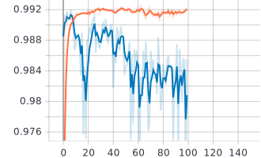
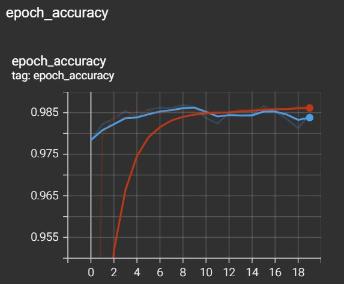

#### TensorFlow implementation of AlexNet("ImageNet Classification with Deep Convolutional Neural Networks"). [The paper](https://proceedings.neurips.cc/paper/2012/file/c399862d3b9d6b76c8436e924a68c45b-Paper.pdf)
An overview of the implementation:
- The [TensorFlow](https://www.tensorflow.org/) documentation has been extremely helpful.
- Used the MNIST dataset for the task
- Resized the images directly to 224x224
- Trained the model for 100 epochs in the Colab environment. Shuffle size: 32
- Uploaded the model I trained in the process, if you would like to use the it.

Please do let me know if I have to correct this implementation in any aspect :)

Result from TensorBoard  
Epoch accuracy: train vs validation with Batch normalization  

Epoch accuracy: train vs validation with Local Response Localization  

Tasks to be done:  
- [X] Comparision of batch normalization(currently used) with local response normalization.
- [ ] Using different datasets to train the model and analyze the results.
- [ ] Implementing early stopping.

